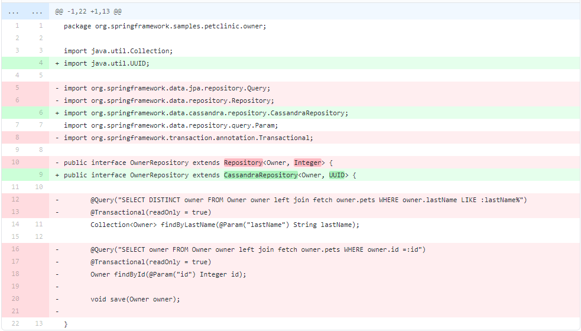
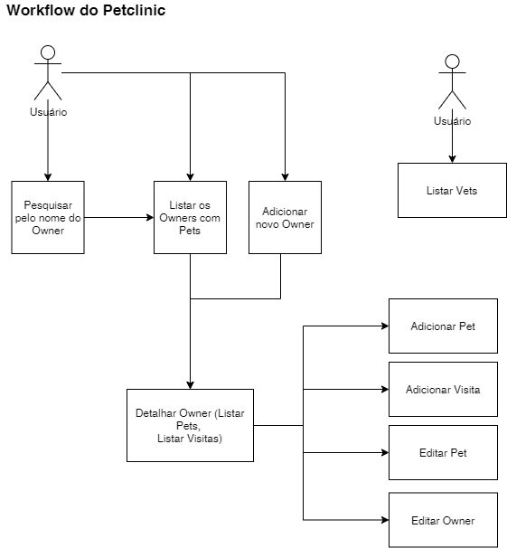
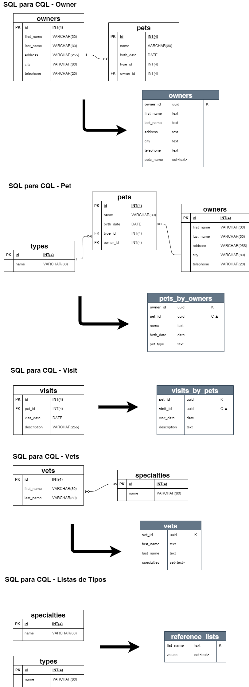

# Spring PetClinic Versão Cassandra/Astra  [](https://travis-ci.com/formatool/spring-petclinic)

[](https://gitpod.io/#https://github.com/formatool/spring-petclinic) 

_Read this in other languages:_ [](readme.md)

Versão Cassandra do Spring PetClinic Sample Application usando o Datastax Astra, um DBaaS multi-cloud feito com Apache Cassandra.

Este projeto é um _fork_ do original https://github.com/spring-projects/spring-petclinic com o objetivo de demonstrar como adaptar uma aplicação SQL para usar o banco Cassandra NoSQL, com o mínimo de esforço possível. O esquema de modelo de dados foi inspirado no projeto https://github.com/spring-petclinic/spring-petclinic-reactive, apresentado no [Workshop From SQL to NoSQL](https://www.youtube.com/watch?v=elRWY8-tMbU).

A arquitetura da aplicação teve apenas uma alteração: As interfaces _repositories_, antes extendidas de `org.springframework.data.repository.Repository`, foram alteradas para extender de `org.springframework.data.cassandra.repository.CassandraRepository`, aproveitando as implementações já criadas do projeto [Spring Data for Apache Cassandra](https://spring.io/projects/spring-data-cassandra)



## Alterações no Modelo de Dados

Um modelo SQL tem algumas diferenças para um modelo CQL. Para realizar essa remodelagem, é importante entender quais são as consultas necessárias na aplicação. Para isso mapeamos o seu Fluxo de trabalho:

### Workflow do Petclinic



### Modelagem SQL para CQL

Com o Worflow em mãos, podemos realizar a modelagem que da um suporte às consultas realizadas na aplicação:



## Crie sua intância Astra

Antes de executar essa aplicação, você deve preparar seu _database_ e _keyspace_ do Datastax Astra.

O serviço `ASTRA` está disponível na url [https://astra.datastax.com](https://dtsx.io/workshop). `ASTRA` é a maneira mais simples de executar o Cassandra sem nenhuma dificuldade - apenas clique no botão e obtenha seu cluster. **Sem a necessidade de cartão de crédito ou qualquer pagamento**, um crédito de $25.00 dólares americanos todos os meses, cerca de 5M _writes_, 30M _reads_ e 40GB de _storage_ mensais - **suficiente para executar pequenas cargas de produção**.

### ✅ Passo 1. Registre (se necessário) e entre (_Sign In_) no Astra

Registre (se necessário) e entre (_Sign In_) no Astra : Você pode usar sua conta do `Github`, `Google` ou registrar-se com o `email`.

Siga esse [guia (em inglês)](https://docs.datastax.com/en/astra/docs/creating-your-astra-database.html) e use os valores abaixo para configurar um banco de dados pré-pago com  crédito mensal de $25 totalmente **FREE**.

Use os valores:

| Parameter | Value 
|---|---|
| Keyspace name | spring_petclinic |

### ✅ Passo 2 - Crie o modelo de dados NoSQL petclinic 

Na tela _Summary_ do seu _database_ , selecione **_CQL Console_** no menu superior da janela principal. Isso o levará ao Console CQL e fará o seu login automaticamente.

Execute o conteúdo dos arquivos [src/main/resources/db/cassandra/schema.sql](src/main/resources/db/cassandra/schema.sql) and [src/main/resources/db/cassandra/data.sql](src/main/resources/db/cassandra/data.sql). (*Copie e cole dentro do console CQL*)

### ✅ Passo 3. Gere seu token

Se você ainda não tiver um, siga as [instruções aqui (em inglês)](https://docs.datastax.com/en/astra/docs/manage-application-tokens.html#_create_application_token) para gerar seu novo token. Depois de criado, **não esqueça de baixar, porque não será possível vê-lo novamente** sem gerar um novo.

### ✅ Passo 4. Defina suas informações de conexão

Execute o script [setup.sh](/setup.sh) e siga as intruções. No gitpod esse script será executado automaticamente.

Depois de executar o script, você terá definido os _environments_:

```
export ASTRA_DB_CLIENT_ID=<Client ID Value>
export ASTRA_DB_CLIENT_SECRET=<Client Secret Value>
```

e você terá o _Secure Connect Bundle_ no arquivo `astra-creds.zip`

## Entendendo o Spring Petclinic com alguns diagramas
<a href="https://speakerdeck.com/michaelisvy/spring-petclinic-sample-application">Veja apresentação aqui (em inglês)</a>

## Executando petclinic localmente

Depois de preparar o banco de dados e suas configurações, você está pronto para executar o aplicativo localmente.

Petclinic é uma aplicação [Spring Boot](https://spring.io/guides/gs/spring-boot) contruída com [Maven](https://spring.io/guides/gs/maven/). Você pode _buildar_ e executar um arquivo jar da linha de comando:

```
git clone https://github.com/spring-projects/spring-petclinic.git
cd spring-petclinic
./mvnw package
java -jar target/*.jar
```

Você pode acessar o petclinic aqui: http://localhost:8080/


Ou você pode executar diretamente do Maven usando o plugin Spring Boot Maven. Fazendo isso, as mudanças que você fizer no projeto refletirão imediatamente (as mudanças no código-fonte Java também requerem uma compilação - a maioria das pessoas usa uma IDE para isso):

```
./mvnw spring-boot:run
```

## Procurando algo em particular?

|Spring Boot Configuration | Class or Java property files  |
|--------------------------|---|
|A Classe Principal | [PetClinicApplication](/src/main/java/org/springframework/samples/petclinic/PetClinicApplication.java) |
|Arquivo de Configuração | [application.properties](/src/main/resources) |
|Caching | [CacheConfiguration](/src/main/java/org/springframework/samples/petclinic/system/CacheConfiguration.java) |
|Configuração Astra | [application-cassandra.yml](/src/main/resources/application-cassandra.yml) |
|Configuração Cassandra | [application-cassandra.yml](/src/main/java/org/springframework/samples/petclinic/system/CassandraConfig.java) |

# License

The Spring PetClinic sample application is released under version 2.0 of the [Apache License](https://www.apache.org/licenses/LICENSE-2.0).

[spring-petclinic]: https://github.com/spring-projects/spring-petclinic
[spring-framework-petclinic]: https://github.com/spring-petclinic/spring-framework-petclinic
[spring-petclinic-angularjs]: https://github.com/spring-petclinic/spring-petclinic-angularjs 
[javaconfig branch]: https://github.com/spring-petclinic/spring-framework-petclinic/tree/javaconfig
[spring-petclinic-angular]: https://github.com/spring-petclinic/spring-petclinic-angular
[spring-petclinic-microservices]: https://github.com/spring-petclinic/spring-petclinic-microservices
[spring-petclinic-reactjs]: https://github.com/spring-petclinic/spring-petclinic-reactjs
[spring-petclinic-graphql]: https://github.com/spring-petclinic/spring-petclinic-graphql
[spring-petclinic-kotlin]: https://github.com/spring-petclinic/spring-petclinic-kotlin
[spring-petclinic-rest]: https://github.com/spring-petclinic/spring-petclinic-rest
